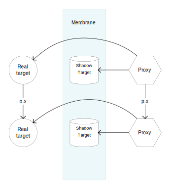

# ECMAScript Proposal: Private Symbols

## Overview

This proposal allows the user to create **private symbols**.

```js
const privateSym = Symbol.private();
```

A **private symbol** is semantically identical to a regular symbol, with the following exceptions:

- Private symbols are not exposed by `Object.getOwnPropertySymbols`.
- Private symbols are not copied by `Object.assign` or object spread.
- Private symbol-keyed properties are not affected by `Object.freeze` and `Object.seal`.
- Private symbols are not exposed to proxy handlers.

See [Semantics](#semantics) for more details.

Like regular symbols, private symbols may be created with a descriptive string:

```js
const privateSym = Symbol.private('My private symbol');
```

The Symbol prototype has a `private` getter function which can be used to determine whether the symbol is private:

```js
if (someSymbol.private) {
  console.log('This is a private symbol');
} else {
  console.log('This is not a private symbol');
}
```

## Goals

This proposal is intended to provide a missing capability to JavaScript: the ability to add properties to an object that are inaccessible without a unique and unforgable key. Moreover, this proposal is intended to be *minimal*, completely *generalized* and strictly *orthogonal*.

- It is *minimal* because it introduces the minimum amount of new concepts to the language.
- It is *generalized* because it is not tied to any particlar type of object or syntactic structure.
- It is *orthogonal* because it does not attempt to solve any problem other than property encapsulation.

The proposal **does not** attempt to provide solutions for:

- Syntactic sugar for symbol-keyed property definition and access.
- Secure branding mechanisms.
- Static shape guarantees.

## Some Questions and Answers

__*Do objects inherit private symbols from their prototypes?*__

Yes.

Private symbols work just like regular symbols when it comes to prototype lookup. There is nothing new to learn. This means that "private methods" on classes just work, without any additional semantics:

```js
const $m = Symbol.private();

class C {
  [$m]() {
    console.log('This is a private method, installed on the prototype');
  }
}

let c = new C();
c[$m]();
```

__*Why don't `Object.assign` and the spread operator copy private symbols?*__

It follows from the definition of `Object.assign` and the spread operator.

They both work by obtaining a list of property keys from the source object, using the `[[OwnPropertyKeys]]` internal method. Since we do not want to allow private symbols to leak, we restrict the definition of `[[OwnPropertyKeys]]` such that it is not allowed to return private symbols.

__*Why don't `Object.freeze` and `Object.seal` affect private symbol-keyed properties?*__

When an object is frozen or sealed, the object is first marked as non-extensible (meaning new properties cannot be added to it) and then a list of property keys is obtained by calling the object's `[[OwnPropertyKeys]]` internal method. That list is then used to mark properties as non-configurable (and non-writable in the case of `Object.freeze`).

Since `[[OwnPropertyKeys]]` is not allowed to return private symbols, `freeze` and `seal` cannot modify any property definitions that are keyed with private symbols.

The fundamental idea is that only the code that has access to the private symbol is allowed to make changes to properties keyed by that symbol.

This requires us to slightly modify the definition of a "frozen" object: An object is "frozen" if it is non-configurable and all of it's own *non-private* properties are non-configurable and non-writable.

__*How does this work with Proxies?*__

Proxies are not able to intercept private symbols, and proxy handlers are not allowed to return any private symbols from the `ownKeys` trap.

For all of the proxy internal methods that accept a property key, if that property key is a private symbol, then the proxy handler is not consulted and the operation is forwarded directly to the target object, as if there were no handler defined for that trap.

This means that simple wrapping proxies "just work" with objects that use private symbols.

```js
const data = Symbol.private();

class C {
  constructor() {
    this[data] = 42;
  }

  getData() {
    return this[data];
  }
}

const c = new C();
const p = new Proxy(c, {});

c.getData(); // 42
p.getData(); // 42
```

__*How does this work with membranes?*__

A membrane is a boundary between object graphs such that all access to objects "across" the boundary are required pass through the membrane's intercession mechanism. When an object "crosses" the boundary, it is wrapped in a proxy, and any objects reachable from that proxy are also wrapped in proxies.



Any membrane that allows its proxies to return *stability guarantees* must use a "shadow target" to allow the Proxy API to uphold *object model invariants*. For instance, if a proxy reveals that it is non-extensible, then it must always report that it is non-extensible, and it may not in the future allow new properties to be added. To uphold these invariants, the Proxy API makes sure that values returned from proxy handlers are consistent with the shape of the proxy's target. The "shadow target" acts as a record of the object model invariants that the proxy has committed itself to.

When a private symbol is used on a membrane proxy, the proxy is bypassed and the operation is applied directly to the shadow target. As it turns out, the shadow target is an ideal store for private symbol-keyed properties: it is isolated from both "wet" and "dry" object graphs and access to it is revoked when the membrane is revoked. As long as the membrane uses the shadow target technique, private symbols cannot be used to bypass the membrane.

With the introduction of private symbols, the shadow target technique is transformed from a practical constriant into a necessary constraint for the implementation of secure membranes.

Membranes are not transparent with respect to private symbols. Given some private symbol `p` shared by objects on both sides of the membrane, property access using `p` as a key will, in general, yield different results when applied to a membrane-proxy versus the object that it wraps. Properties that are keyed with private symbols are effectively isolated to the object graph in which they are used.

It is not possible for a membrane to support both both privacy and transparency at the same time. If a membrane allows privacy, then it must reject transparency: operations involving private state must be isolated to their own object graph. If a membrane is perfectly transparent, then it cannot support privacy: operations involving supposedly "private" keys would have to be intercepted by, and leaked to, the proxy.

__*Can private symbols be used for branding?*__

No.

The purpose of a branding mechanism is to mark objects such that, when presented with an arbitrary object, the code that created the "brand" can determine whether or not the object has been marked. In a typical scenario, objects are branded by constructor functions so that method invocations can check whether the `this` value is an object that was actually created by the constructor function.

Private symbols are not appropriate for branding because a proxy can be used to transparently wrap an object. If the proxy target has a private symbol-keyed property, then the wrapping proxy will happily report that the proxy does as well:

```js
const sym = Symbol.private();
const obj = { [sym]: true };
const proxy = new Proxy(obj, {});

Boolean(Reflect.getOwnPropertyDescriptor(obj, sym)); // true
Boolean(Reflect.getOwnPropertyDescriptor(proxy, sym)); // true
```

The appropriate mechanism for branding already exists: `WeakSet`.

```js
const brand = new WeakSet();
const obj = {};
const proxy = new Proxy(obj, {});

brand.add(obj);

brand.has(obj); // true
brand.has(proxy); // false
```

As a user, sometimes you want data encapsulation, sometimes you want branding, and sometimes you want both. It is better to address these separate concerns with separate features.

See [brandage](https://github.com/zenparsing/brandage) for a simple WeakSet subclass that can be used for easy object identity branding.

__*Doesn't this proposal sacrifice "static shape" guarantees for private state?*__

In general, it is not possible to provide static shape guarantees in JavaScript, nor is that a core language strength. It is the job of the JavaScript engine to infer static shape from the structure and behavior of the program at runtime.

__*Square brakets are ugly! Why doesn't this proposal include a more pleasant syntax?*__

This proposal adds a missing capability to the language. A future proposal may provide syntactic sugar for symbol-keyed property definition and access. Hopefully such a syntactic feature would provide sugar for both regular *and* private symbol usage.

Another option is to use source-to-source transformation to convert property names with leading underscores into private symbol lookups. See [Babel Plugins](./babel-plugins) for an example.

__*Does this replace private class fields and methods?*__

Yes. See [Private Symbols, or Private Fields](./symbols-or-fields.md).

## Semantics

- Symbols have an additional internal value `[[Private]]`, which is either **true** or **false**. By definition, private symbols are symbols whose `[[Private]]` value is **true**.
- The invariants of `[[OwnPropertyKeys]]` are modified such that it may not return any private symbols.
- The definition of `[[OwnPropertyKeys]]` for ordinary objects (and exotic objects other than proxy) is modified such that private symbols are filtered from the resulting array.
- The proxy definition of `[[OwnPropertyKeys]]` is modified such that an error is thrown if the handler returns any private symbols.
- The proxy definitions of all internal methods that accept property keys are modified such that if the provided key is a private symbol, then the operation is forwarded to the target without consulting the proxy handler.
- A new function is added for creating private symbols: `Symbol.private([description])`.
- A new getter named `private` is added to `Symbol.prototype`, which returns the symbol's [[Private]] value.

See [Specification Changes](spec-changes.md) for more details.
